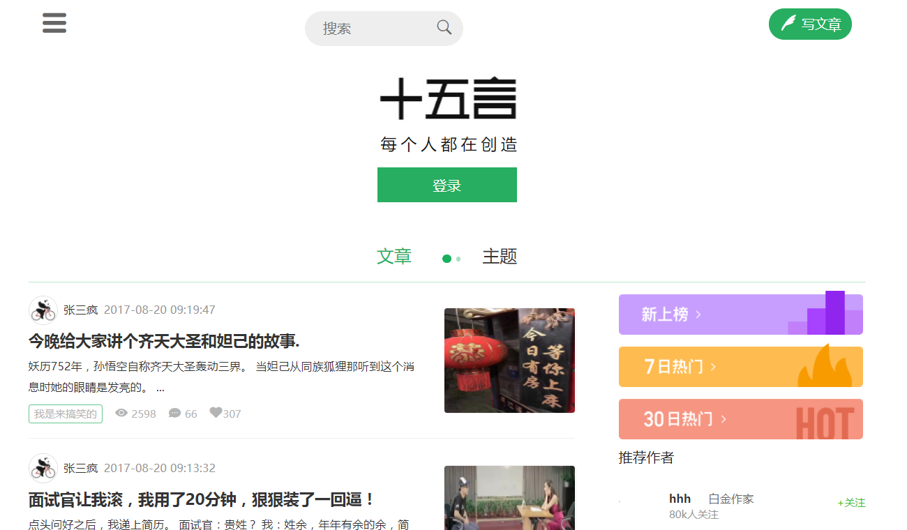

# mvc模式的php阅读网站前台及后台管理（仿简书、十五言）

## MVC是一个架构模式，它分离了表现与交互。它被分为三个核心部件：模型、视图、控制器。下面是每一个部件的分工：
* view: 视图是用户看到并与之交互的界面。
* moudel: 模型表示业务数据，并提供数据给视图。
* controller: 控制器接受用户的输入并调用模型和视图去完成用户的需求。

## libs  (公共类)
* db.class.php
> 数据库增删改查
* pages.class.php
> 分页
* regcode.class.php
> 图片验证码
* session.class.php
> 登录验证session
* route.class.php
> controller, mvc路由(页面分发)
* upload.class.php
> 上传
* functions.class.php
> 常用函数
* smarty
> 模板引擎
## moudel
> 模型管理 数据发布
## template
> view 页面展示
### BY-wuyw
